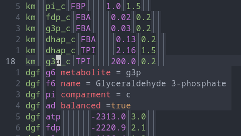

# maud-lsp

A Language Server for [Maud](https://github.com/biosustain/Maud).

Supports `Hover` and `GotoDefinition`.

 

## TODO

- [x] Handle `MetaboliteInComparment`.
- [x] Handle `Reaction`.
- [x] Handle `Enzyme`.
- [x] Fail gracefully when symbol was not found.

## Acknowledgments

Everything was more or less stolen from [`rust-analyzer`](https://github.com/rust-lang/rust-analyzer/).

## License

Licensed under either of

- Apache License, Version 2.0, ([LICENSE-APACHE](LICENSE-APACHE) or http://www.apache.org/licenses/LICENSE-2.0)
- MIT license ([LICENSE-MIT](LICENSE-MIT) or http://opensource.org/licenses/MIT)

at your option.

### Contribution

Unless you explicitly state otherwise, any contribution intentionally submitted for inclusion in the work by you, as defined in the Apache-2.0 license, shall be licensed as above, without any additional terms or conditions.
